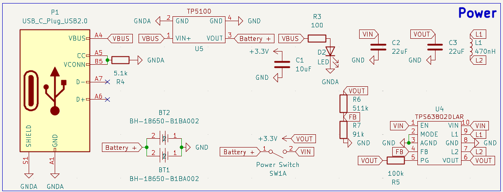

# June 6th: Drone Parts Selected + Work On Transmitter Electronics

I looked around at some images prior to starting this project and decided I wanted my drone to have a smaller form factor, similar to a APEX 2" drone.

That inspiration frame looks like this:

After looking around at some other builds of this form factor, I found some similar parts that I could use and created a parts list in this google doc:
> https://docs.google.com/document/d/1UYxp3Jcj_MZBELJUi8HEg_IUyJKEcsd3nflhL_p9VP8/edit?usp=sharing

Finding good parts on AliExpress was more tedious then I expected as the prices seemed to keep changing, but I think I have a good completed list for the drone that should work well together.

I also worked to figure out how I could control the drone with a custom transmitter PCB.
I found that the flight controller I selected would work with ExpressLRS, which is an open source radio link protocol that would work with an ESP32 based transmitter. By pairing the ESP32 with an appropriate LoRa module I found, I should be able to create a custom transmitter PCB that can control the drone.

(The Transmitter Electronics list is still a work in progress)

**Total time spent: 4.5h**

# June 21st: Back From Surgery! Finalized Transmitter Electronics

I had to take a massive break from this project due to a surgery I had, but now that I'm back I can continue working on the drone.

I figured out the final parts I would need for the transmitter electronics and found suitable parts on AliExpress.
Once again, finding such parts with the specifics I was looking for was more time consuming than I was hoping for.

I wanted to keep the device charging as easy as possible so I am using USB-C for the power input and 18650 battery charging.

I also created a mockup of the transmitter electronics that I will be designing in KiCAD.

**Total time spent: 4h**

# June 22nd: Started PCB Design in KiCAD

With the parts selected, all I needed to do was add them into KiCAD...
Little did I know this would be the hardest part of the session.

Finding all of the correct schematics and footprints for the parts was what I spent a good few hours on.
Eventually I had gotten the schematics and footprints imported correctly into KiCAD as shown by these glorious screenshots:

After getting these key components in, I wired up the schematic starting with the power section.

After getting the power section wired up, I moved on to the LoRa module and ESP32 transmitter section.

The last thing I worked on for the day was a custom footprint for the TP5100 battery charger as well as removing the keepout zone from the LoRa ESP32 module. (As it would not need to use Wifi or Bluetooth)

**Total time spent: 5h**

# June 23rd: Finished PCB Schematic Design

I finished up the input side of the controller by adding pins to interface with the gimbals and switches.

I also went through and added a footprint for each of the components in the schematic that didnt already have one.

>*No harm in double checking the footprints, right?*
>

**Total time spent: 2h**

# June 23rd: Wait theres a problem...

While looking over the schematic, I realized that I had made a mistake in the power section.
Due to some interesting advertising, I had thought that the TP5100 battery charger could handle 2S batteries, but it turns out that is not the case.
I elected to switch my batteries into a parallel configuration instead of series, which would allow me to use the TP5100 charger.
This meant I had to change my buck converter since the new nominal voltage would be 3.7V instead of 7.4V. (The buck converter I had selected needed at least 6V to operate)
Soon I was down the rabbit hole of finding a new buck converter that would be able to work with the new voltage.

During this process, I found the WEBENCH Power Designer by Texas Instruments, which I used to create a buck boost converter schematic that would work with the new voltage.

I also found some components on LCSC for the schematic.

**Total time spent: 2 more hours...**

# June 24th: Finished PCB Schematic Design (Again)

Figuring out how to import all of the components from LCSC into KiCAD quicker this time. The issue was that it did it in a kinda weird way, leaving me going around in circles trying to figure out how to actually get the parts into my schematic.
Anyway, I got the parts imported and added to the schematic and wired them up.

The next challenge was figuring out the footprint naming conventions for the parts. 
>*imperial vs metric woes...*
After I did this I was able to update all of the footprints to be the correct, cheap, smd components. (Soldering this later will be fun...)

At this point I should be ready to finally start the PCB layout :p

**Total time spent: 3h**
